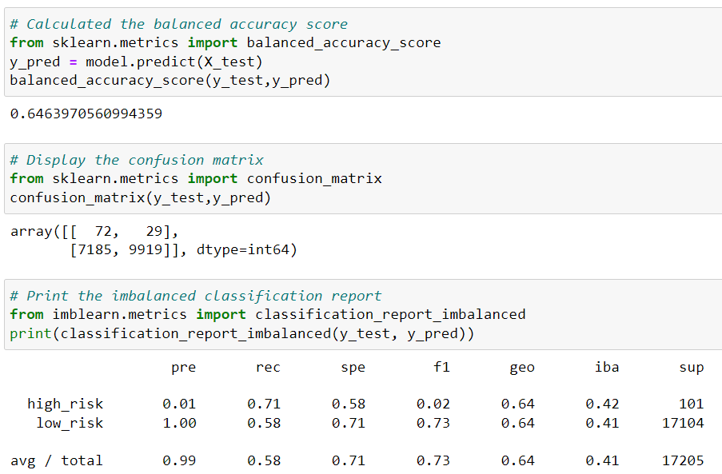
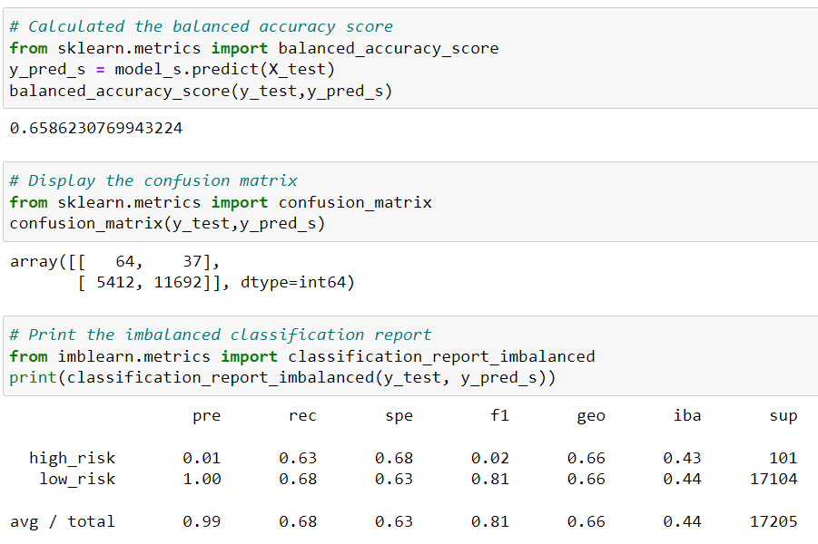
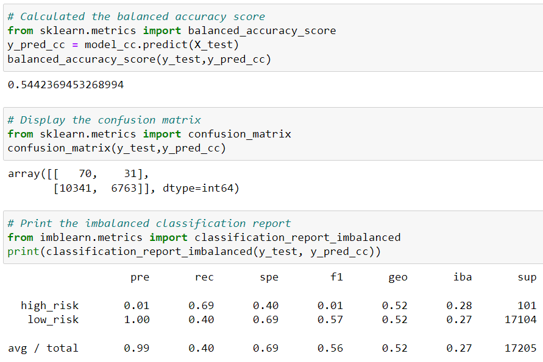
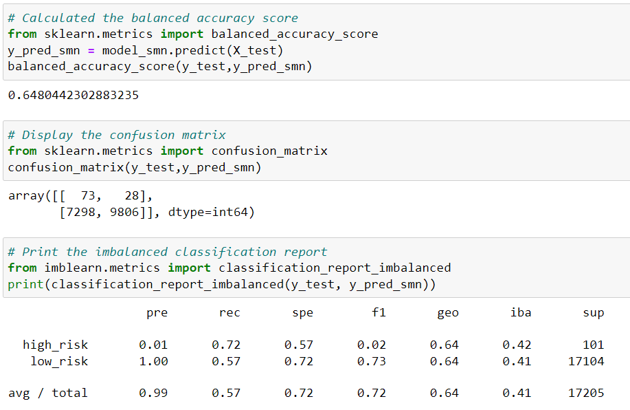
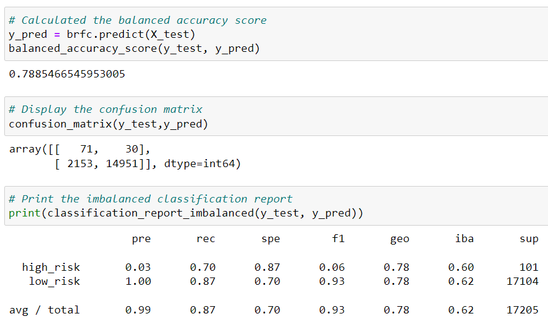
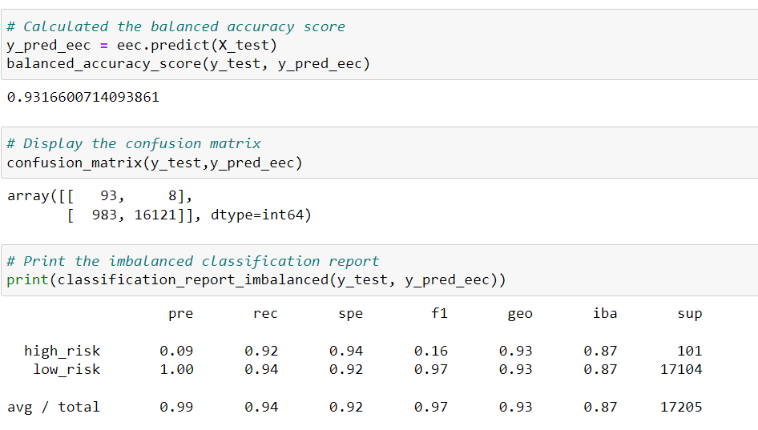

# Credit_Risk_Analysis
## Overview of the loan prediction risk analysis
Machine learning is super powerful in determining potential loan risks by learning from previous credit history and making predictions. 
  This analysis is to compare two different machine learning models: Logistic Regression Model and Ensembling Classifiers with different techniques to figure out the model that works the most effectively and efficiently on determining loan risks. <Strong>Machine learning models and techniques as follows:</Strong>

1. Logistic Regression
    - Random Oversampling
    - SMOTE
    - ClusterCentroids
    - SMOTEENN
2. Ensembling
    - Balanced Random Forest Classifier
    - Easy Ensembling Classifier

## Results
After training 2 models with different sampling techniques, we have following balanced accuracy scores, precision score and recall scores:
### Logistic Regression
- Random Oversampling
 The balanced score of using random oversampling technique is 0.64639, high risk precision score is 0.01, and high risk recall score is 0.71.

- SMOTE
 The balanced score of using SMOTE oversampling technique is 0.65862, high risk precision score is 0.01, and high risk recall score is 0.63.

- ClusterCentroids
 The balanced score of using ClusterCentroids undersampling technique is 0.54423, high risk precision score is 0.01, and high risk recall score is 0.69.

- SMOTEENN
 The balanced score of using SMOTEENN, a combination of oversampling and undersampling technique is 0.64804, high risk precision score is 0.01, and high risk recall score is 0.72.

### Ensembling
- Balanced Random Forest Classifier
 The balanced score of using Balanced Random Forest Classifier is 0.78854, high risk precision score is 0.03, and high risk recall score is 0.70.

- Easy Ensembling Classifier
 The balanced score of using Easy Ensembling Classifier is 0.93166, high risk precision score is 0.09, and high risk recall score is 0.92.

## Summary
 In credit risk analysis, the high risk class size is usually significantly smaller than the low risk class. The dataset in this analysis also shows the same pattern with 68,470 sets of data classified as low risk and 347 sets as high class. With the imbalanced datasets, we are trying to use different resampling techinques to train the models with both classes well represented in the training sample so the pattern can be trained at balanced possibility.4
 
 After comparing the balanced accuracy score, precision and recall score of the above six different machine learning techniques, we found that the <Strong>easy ensembling classifier</Strong> has the best balanced accuracy score, as well as highest precision and recall scores within all the techniques, which means the model is most reliable as we have the least false negative in the prediction. 
 
 As Easy Ensembling Classifier works by undersampling the datasets(selecting all examples from the minority class and a subset from the majority class), and then fitting multiple decision trees sequentially on datasets, in the process of which puts more weight on the misclassified datasets and less on the correctly classified examples, resulting in minimized error in the predicted classification. 
